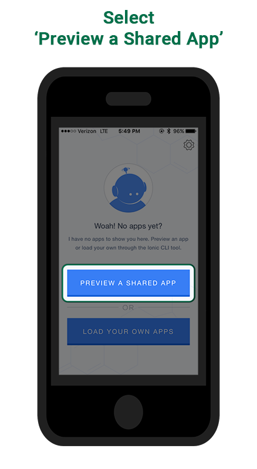
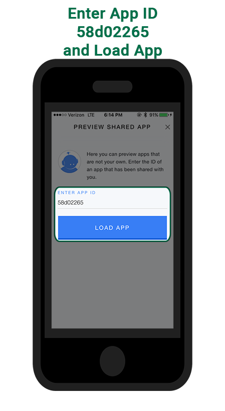
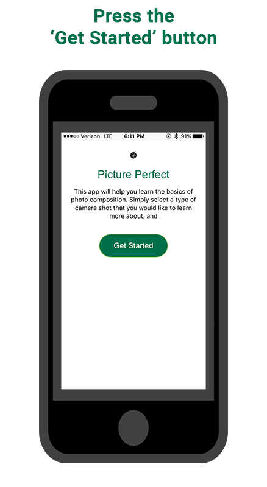
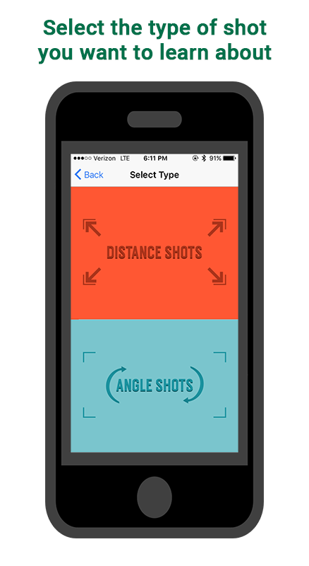
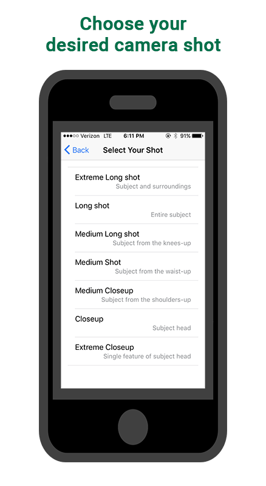
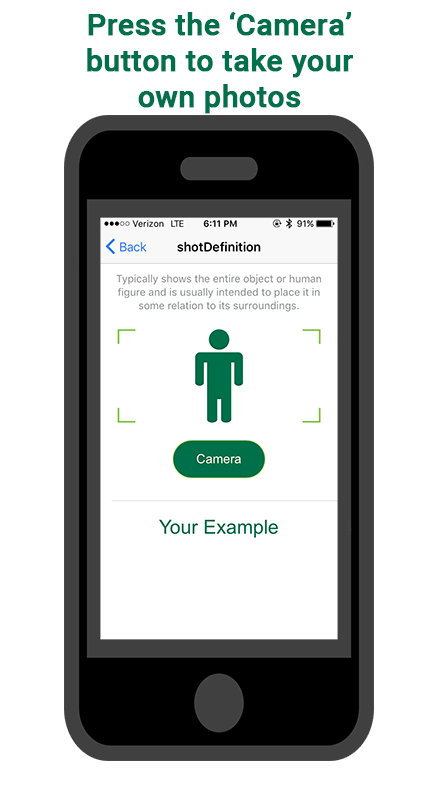

# pictureperfect
##
       

**Our [Github Repository](https://github.com/soft-eng-practicum/pictureperfect)**

**Our Communication Tools:** *Slack*

**Our Process Tool: _Maybe_ [Trello](https://www.trello.com)**

## Group Members
1. Anwar Saleeby: Project Group Leader & Client Liason

2. Alain Hirwa: UI/UX

3. Neal Klemenc: Testing, Documentation

## User Manual
                            Installation
Download Ionic View: [[Android]](https://play.google.com/store/apps/details?id=com.ionic.viewapp&hl=en) [[IOS]](https://itunes.apple.com/us/app/ionic-view/id849930087?mt=8)

<section>
   
   
</section>

                            Usage
<section>
   
   
   
   
</section>
